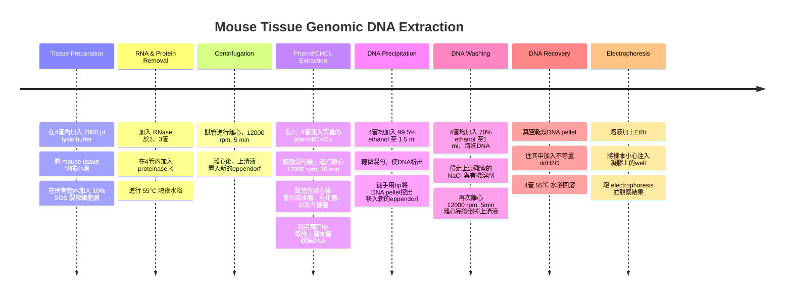

# 小鼠組織基因體 DNA 萃取實驗 Mouse tissue genomic DNA extraction

## 實驗目的
- 學習自小鼠組織萃取 genomic DNA 之基本原理與操作流程
- 了解 RNase 與 $Phenol/CHCl_3$ 於 DNA 萃取過程中的功能，並探討 RNA 與蛋白質污染對 DNA 純度之影響
- 利用 agarose gel electrophoresis，比較不同處理條件下 DNA 條帶之差異，分析 DNA 純度、完整性與可能之污染情形

---

## 實驗原理
- 此次實驗利用化學裂解與有機溶劑抽取方式，自小鼠組織中萃取 genomic DNA
- 實驗中利用的 **lysis buffer** 中: 
  - **Tris-HCl** 可維持適當 pH
  - **EDTA** 可螯合 $Mg^{2+}$ ，**抑制 DNase 活性**
  - $NaCl$ 在水中解離成離子，有助於**維持 DNA 穩定性**
  - **SDS** 為界面活性劑，可**破壞細胞膜與核膜**並使蛋白質變性
- **Proteinase K** 可分解組蛋白及其他蛋白質，使 DNA 從 nucleoprotein complex 中釋放
- **RNase**可分解 RNA，以減少 RNA 在lane上的汙染
- 加入 $Phenol/CHCl_3$ 可使蛋白質變性，並進入有機層，而使 DNA 保留於水層中，以提升 DNA 純度
- 其後利用 **ethanol** 析出DNA，使 DNA 沉澱，再經 washing 去除鹽類與殘留雜質
- 最後利用 **agarose gel electrophoresis** ，透過觀察條帶分析 DNA 之完整性與純度。不同處理條件下之條帶型態可反映 RNA、蛋白質污染下出現的條帶情形

---

## 實驗材料

|材料|功能|
|---|---|
|**lysis buffer**|讓DNA穩定，形成能抑制酶的化學環境，其中:  • **tris-HCl**：維持pH值8.0 • **NaCl**：中和並穩定DNA的雙股螺旋結構 • **EDTA**：螯合二價鎂離子，使DNase失活|
|**SDS**|介面活性劑，裂解細胞膜與核膜，使DNA釋出|
|**RNase**|分解去除RNA，留下DNA|
|**proteinase K**|破壞並分解染色體上的組蛋白|
|**phenol**|有機溶劑，可用來吸附雜質、色素、脂肪、RNA|
|**chloroform**, $CHCl_3$|去除phenol|
|**99.5% ethanol**|降低DNA水合能力，DNA因此從水中自然析出|
|**70% ethanol**|洗DNA，去除殘留的NaCl|
|**TE buffer**|一種混合溶劑，為**Tris + ETDA**的組合，可用來長時間儲存DNA樣本|
|**EtBr**|**Ethidium bromide**，屬於DNA染劑，會嵌入DNA的GC pair，也是致癌物質|

---

## 實驗步驟簡介

- 最終，四管根據添加的酵素跟物質如下: 

|sample|第一管|第二管|第三管|第四管|
|---|---|---|---|---|
|**RNase**|-|+|+|-|
| $Phenol/CHCl_3$ |	-	|+|	-	|+|

---

## 步驟細節說明
### 為何要剪碎 mouse tissue，並且加lysis buffer（Tris-HCl、NaCl、EDTA）
- 實驗開始時先利用剪刀將小鼠組織剪成較小碎片，目的是**增加組織與 lysis buffer 的接觸面積，使裂解液更容易滲透至組織內部**。由於完整組織由許多細胞緊密排列，若不先剪碎，裂解液較難均勻進入所有細胞，可能造成部分細胞無法完全裂解，降低 DNA 釋放效率
- 加入 lysis buffer 後，可協助破壞細胞膜與細胞核周圍結構，並提供適當的化學環境（如維持pH、離子強度等），提供一個穩定且保護性的環境，避免 DNA 受到降解。使後續加入的 SDS、Proteinase K 與 RNase 能更有效作用
- 因此剪碎組織不只是單純減小體積，也能提升細胞裂解效率、增加 DNA 釋放量，並提高後續 DNA 萃取的品質與產量

#### lysis buffer內容物功能介紹
- **Tris-HCl: 維持 pH 值約8.0**
  - 作為緩衝系統，用來維持溶液的酸鹼值穩定。DNA 在過酸或過鹼環境下容易發生結構改變甚至斷裂，如酸性環境可能促進DNA去嘌呤反應，而強鹼則可能影響雙股結構穩定性
  - 因此 Tris-HCl 維持約 pH 8.0 的環境，可提供適合 DNA 保存的條件，避免 DNA 在萃取過程中受到化學性損傷。
- $NaCl$ **: 中和並穩定 DNA 雙股螺旋結構**
   - DNA 骨架含有大量磷酸基，因此整體帶有許多負電荷。若沒有離子存在，這些負電荷彼此會產生排斥作用，影響 DNA 結構穩定性
   - $NaCl$ 中的 $Na^+$ 可與 DNA 上的負電荷結合，降低 DNA 鏈間的靜電排斥，使 DNA 雙股螺旋維持穩定
   - 此外， $Na^+$ 也有助於 DNA 與蛋白質分離，並在後續加入ethanol時，協助 DNA 聚集沉澱，提高 DNA 回收率
- **EDTA : 螯合二價鎂離子** $Mg^{2+}$ 
   - EDTA (Ethylenediaminetetraacetic acid) ，是一種**金屬離子螯合劑**，可與 $Mg^{2+}$ 、 $Ca^{2+}$ 等二價金屬離子結合
   - 許多核酸分解酵素必須依賴 $Mg^{2+}$ 作為輔助因子才能正常作用，因此 EDTA 會先將 $Mg^{2+}$ 移除，使 DNase 失去活性，避免 DNA 在萃取過程中被分解
   - 換句話說，EDTA 的主要作用是保護 DNA 完整性，提高 DNA 萃取品質

### 分次加入 lysis buffer 的原因
- 分兩次加入 lysis buffer ，目的是**提供足夠體積與濃度**，使所有細胞能完全接觸裂解成分
- 若一開始就一次加入大量裂解液，組織漂浮在溶液中，容易導致不充分剪碎，影響實驗操作，因此分兩次加入可兼顧組織機械性破碎與後續化學裂解效率，使細胞膜與細胞核膜更完整地被破壞，提高DNA的產量與品質

### 加入 SDS + Proteinase K + RNase 的作用
#### SDS（Sodium dodecyl sulfate，十二烷基硫酸鈉）
- 陰離子界面活性劑，可**破壞細胞膜與核膜中的脂質雙層**，使細胞發生裂解並釋放細胞內容物
- 此外，SDS也可破壞蛋白質內部的疏水作用、非共價作用力，使蛋白質失去原本的三維結構而發生變性
- 蛋白質被展開後，其結構變得鬆散，因此更容易被後續加入的 Proteinase K 分解
#### Proteinase K
- 屬於一種廣效性蛋白酶，可分解細胞中的各類蛋白質，能夠**包覆 DNA 的組蛋白 (histone)** 也可能有**降解DNA的核酸酶 (DNase) 的功能**
- 由於 DNA 在細胞核內通常與組蛋白結合形成染色質，因此移除這些蛋白質後，DNA可從複合結構中釋放出來
- 與此同時，去除 DNase 也可避免 DNA 於萃取過程中被分解，提高 DNA 完整性
#### RNase
  - 是專門**分解細胞中RNA的酵素**。由於細胞內RNA含量相當高，若不去除RNA，可能與DNA共同被萃取出來，造成樣品污染，影響DNA濃度測定及後續PCR、電泳等分析結果
  - 因此加入RNase可降低RNA干擾，提高DNA樣品純度

### 55°C 過夜培養的目的
- 該步驟主要目的是**提供適合酵素作用的環境**，使細胞內容物能被更完整分解
- 由於Proteinase K 在約 50–60°C 之間具有良好的酵素活性，因此 55°C 且長時間的培養可提升其分解蛋白質的效率，加速組蛋白、核酸酶以及其他細胞蛋白的水解作用

### 離心的作用
- 經過 SDS、Proteinase K 與 RNase 處理及55°C培養後，利用離心產生的高速離心力，依據各成分的大小與密度差異進行分離
- 較大且較重的未完全裂解組織、細胞殘骸及其他不溶性碎片會沉降至離心管底部形成沉澱，而已從細胞中釋放出的 DNA 及其他可溶性物質則保留於上清液中
- 此步驟的主要目的為**去除未裂解組織與細胞碎片**，以降低雜質干擾並提高後續DNA純化效率
- 當離心完成後，再小心吸取上清液至新的離心管中進行後續處理，由於 DNA 於細胞裂解後已溶解於溶液中，因此**大部分 DNA 存在於上清液內**，而取出上清液可有效將 DNA 與大部分固體雜質分離，提高後續 Phenol/CHCl₃ 萃取及 DNA 純化的品質與回收率。

### 為何要改以寬口tip吸取上清液
- 在離心完成後，使用寬口吸管吸取上清液，是為了**減少genomic DNA 受到機械剪切的影響**
- 由於基因體 DNA 分子非常長且脆弱，若使用一般較細的吸管尖端快速吸取，DNA在狹窄空間內會受到較大的剪切力，可能造成 DNA 斷裂或降解，影響 DNA 完整性
- 使用寬口tip可減少吸取時的阻力與剪切作用，避免 DNA 受損，進而提高 DNA 的完整性與後續電泳、PCR 等分析結果的品質

### 加入 $Phenol/CHCl_3$ 的主要原因
- **Phenol**
  - 苯酚可用來**去除樣品中的蛋白質，以提高DNA純度**，因為 Phenol 可使蛋白質發生變性，破壞蛋白質原有的立體結構及非共價作用力，使蛋白質失去原本的功能與穩定性
  - 變性後的蛋白質會聚集，並在離心後分布於中間層或有機層中，而具有較高親水性的DNA則會保留於上層水層中
  - 此步驟可有效移除組蛋白、酵素及其他細胞蛋白質，避免蛋白質污染DNA樣品，進而提高後續 DNA 分析、PCR 及電泳實驗結果的準確性與品質
- $CHCl_3$
  - 氯仿 (chloroform) 能夠**促進溶液分層，並協助去除脂質與其他雜質**
  - 氯仿具有較高密度，可幫助水相與有機相形成更明顯的界面，使離心後各成分更容易依性質分離
  - 細胞中的脂質因具有疏水性，會傾向進入有機層中，因此可藉由氯仿將脂質及部分脂溶性色素去除
  - 此外，氯仿也可**協助移除殘留 Phenol**，避免 Phenol 殘留於 DNA 樣品中影響後續電泳分析。因此加入氯仿可使 DNA 與蛋白質、脂質等雜質更有效分離，提高 DNA 的純度與品質

### 加入 99.5% ethanol 的原因
- 這一步是為了**使 DNA 沉澱析出，以便後續收集與純化**
- DNA 分子因具有磷酸骨架而帶有負電荷，在水溶液中周圍會形成水合層，因此可穩定溶解於水中
- 當加入無水的乙醇後，會降低溶液的介電常數及DNA周圍的水合能力，使水分子較不容易包圍 DNA 分子
- 同時在溶液中鹽離子 (如 $Na^+$ )的作用下，可中和 DNA 上的負電荷，降低 DNA 分子間的排斥力，使 DNA 彼此聚集並形成沉澱
- 經過此步驟後，DNA 通常會呈現白色絲狀或棉絮狀沉澱，便於後續分離、清洗及保存，提高 DNA 的回收率與純度。

### 後續加入 70% ethanol 的原因
- 這一步驟不同於加入無水乙醇，主要是**用來清洗DNA沉澱中殘留的鹽類、Phenol、氯仿及其他雜質，同時避免 DNA 再次溶解**，而不是為了脫水
- 由於 DNA 在含有 30% 水分的 70% 乙醇中，仍維持低溶解度，因此 DNA 會持續保持沉澱狀態，而部分鹽類與小分子雜質則可溶於溶液中被移除
- 若殘留過多鹽類或有機試劑，可能影響後續PCR、限制酶切割、電泳及其他分子生物學分析，因此利用 70% 乙醇清洗可進一步提高 DNA 樣品的純度

### 為何要乾燥 DNA pallet
- 這是為了**去除 DNA 沉澱中殘留的乙醇，以避免酒精影響後續實驗分析**
- 在經過 70% 乙醇清洗後，雖然大部分鹽類與雜質已被去除，但 DNA 沉澱表面仍可能殘留少量乙醇。若殘留酒精未完全去除，可能會抑制PCR反應、限制酶切割、DNA 聚合酶作用及其他酵素反應，進而影響後續實驗結果
- 因此通常將 DNA 進行短時間風乾或置於適當溫度下乾燥，使殘留乙醇充分揮發，而在乾燥過程中也需避免過度乾燥，以免DNA難以再次溶解，影響後續使用
- 這次實驗裡面，為了提高實驗效率，使用了真空乾燥機，並且在乾燥前先將pallet以及eppendorf上的小水珠去除乾淨，以加快進度

### 加 TE buffer 或 dd $H_2O$
- 這兩種溶解DNA的溶劑可以在不同的情況下使用

|溶劑|作用|缺點|註解|
|---|---|---|---|
|**TE buffer**|適合用來**長期保存DNA**|如遇到需要PCR，要用聚合酶時，EDTA會造成聚合時的干擾 (polymerase本身也需要二價離子)|為**Tris-HCl + EDTA**，也就是作為pH穩定劑及二價離子螯合劑，避免影響DNA的完整性，以便將DNA長期保存|
|**dd** $H_2O$ |適合**短期快速溶解DNA，不須經過後續處理**|沒有buffer的保護，容易導致degradation或是hydrolysis|使用ddH₂O 可避免一般水中可能含有的金屬離子、鹽類或其他雜質干擾 DNA 樣品，提高樣品純度。溶解後的 DNA 可直接進一步應用於 PCR、電泳、定序或其他實驗|

### 為何最後要加 EtBr
- 加入Ethidium bromide能讓 **DNA 在電泳完成後能被觀察**
- EtBr是一種螢光染劑，可嵌入DNA 的 GC 鹼基對之間並與 DNA 結合。在電場作用下，DNA 會因磷酸骨架帶負電而向正極移動
- 不同大小的 DNA 片段會因移動速度不同而分離。電泳結束後，將凝膠置於紫外光下觀察，**EtBr 會吸收紫外光能量並發出橘紅色螢光**，因此可顯現出 DNA 條帶的位置與強度。藉由觀察條帶的位置可判斷 DNA 大小
- 條帶亮度則可大致反映 DNA 含量，進一步評估 DNA 萃取是否成功及 DNA 品質。

---

## 實驗結果跟電泳圖

> ##### fig.1  DNA萃取的電泳圖分析
> - EtBr在紫外線照射下會發出螢光，圖中的亮帶就是DNA或是RNA的條帶。圖上方為負極，下方為正極，由於DNA跟RNA本身帶負電，因此條帶會在電場下往圖的下方方向移動。
> - 此一共為四組的數據，每一條lane各為不同樣本，一組一共四個樣本。最左邊的lane是參考的marker，左二到左五的lane分別為第一組的第一管到第四管數據，左六到左九的lane分別為第二組的第一管到第四管數據，以此類推
> - 本組的實驗樣本屬於第一組，也就是左二到左五的lane。

### 電泳原理與理想結果
- DNA 電泳是利用 DNA 分子磷酸骨架帶有負電荷的特性，在電場作用下使 DNA 由負極往正極移動，並依據 DNA 分子大小進行分離
- 較小的 DNA 片段可較容易通過 agarose 凝膠中的孔洞，因此移動速度較快，而較大的 DNA 移動較慢
- 由於本實驗萃取的是小鼠基因體DNA，其分子量非常大，因此理想且成功的結果通常會在well附近觀察到明顯且集中的亮帶，僅略微向下移動，而不會跑到膠體下方
- 若條帶清晰、無明顯拖尾（smear），表示 DNA 完整性良好且未受到嚴重降解。若出現長條拖尾或大量訊號往下擴散，則可能表示 DNA 發生剪切、降解，或有RNA、蛋白質等雜質殘留
- 根據我們四管樣本的情形，出現的理論結果應為如下: 

|sample|理想情形|
|---|---|
|第一管 未加RNase，也未加 $Phenol/CHCl_3$ |• 此組未去除RNA，也未利用 $Phenol/CHCl_3$ 去除蛋白質、脂質與色素 • 由此可推測 DNA 樣品純度最低 • 電泳時理想上會在well附近看到高分子量 DNA 亮帶，但同時下方可能會出現明顯smear或額外亮帶 • RNA 分子量較小，會往下移動，而殘留蛋白質、脂質及其他雜質也可能干擾 DNA 移動，使條帶較模糊或產生smear • 此組通常是最不乾淨的電泳結果|
|第二管 加RNase，也加 $Phenol/CHCl_3$ |• 此組同時去除了 RNA 及蛋白質、脂質等雜質，因此理論上 DNA 純度最高 • 電泳結果應在well附近出現清晰、集中且較亮的高分子量 DNA 條帶，幾乎不應有明顯smear現象，下方也不應出現額外 RNA 訊號 • 由於 DNA 完整性較佳，因此此組通常應為最接近理想結果的樣品|
|第三管 僅加RNase|• 此組利用 RNase 去除 RNA，因此可避免小分子 RNA 向下移動形成額外條帶 • 但由於未加入 $Phenol/CHCl_3$ ，蛋白質、脂質與色素等雜質仍可能存在。電泳時理論上仍會在well附近看到 DNA 亮帶，但較模糊，且有smear • 雖然下方 RNA 訊號會比第一管少，但因蛋白污染未去除，因此純度通常低於第二管|
|第四管 僅加 $Phenol/CHCl_3$ |• 此組利用 $Phenol/CHCl_3$ 去除蛋白質與脂質，因此 DNA 樣品中蛋白污染較少 • 但由於未加入 RNase，RNA 仍會存在 • 電泳時 DNA 主條帶應出現在well附近，但膠體下方可能出現額外亮帶，因為較小的 RNA 片段會向下快速移動 • 其整體條帶通常比第一管清楚，但產生的是兩條條帶|

- 依理論上的 DNA 品質比較，第2管（RNase + $Phenol/CHCl_3$ ） 應最好，因同時去除RNA與蛋白質等雜質，第3管（RNase） 與第4管（ $Phenol/CHCl_3$ ） 品質次之。前者去除 RNA 但仍有蛋白質殘留，後者去除蛋白質但仍含 RNA ，第1管（未處理） 因雜質最多，DNA 純度最差
- 若以電泳圖乾淨程度比較，理論上應為: 

$$ \text{第2管} > \text{第3管} > \text{第4管} > \text{第1管}$$

### 組內跟組間分析
#### 第1組結果分析（本組結果）
- 第一管：因未加入RNase及 $Phenol/CHCl_3$ ，故應含有之雜質最多，在well上較亮的條帶，為較大的蛋白質分子引響DNA的移動，故亮帶集中在well前而沒有向前跑，DNA的亮帶也出現smear。**合乎實驗預期結果**
- 第二管：因同時加入RNase及 $Phenol/CHCl_3$ ，理論上DNA應純度最高，在結果上也可以看到一條遠離well的亮帶出現，但電泳發現也有一部份量集中在well中，未向前跑，故可能在加取Phenol/CHCl₃離心後，吸取到中間的乳化層，而使樣品不純，雜質卡在前端導致條帶未往前跑
- 第三管：未有任何條帶出現，可能為實驗時操作不當，導致DNA未被萃取出來，或是風乾後回溶不完全，導致沒有條帶產生
- 第四管：因未加入RNase故應殘留些許RNA碎片，RNA分子較小故出現第二條條帶。**合乎實驗預期結果**，雖然整體的DNA或是RNA含量不多，因此兩個亮帶皆較不明顯

#### 第2組結果分析
- 第一管：應為雜質最多的一管，因為未去除的大分子如蛋白質引響，使得DNA分子無法向前跑，條帶集中在well前。**合乎實驗預期結果**
- 第二管：理應為DNA最純的一管，加樣孔未有亮帶，蛋白質可能已經完全去除，DNA條帶也有出現，無明顯smear，**合乎實驗預期結果**，但DNA條帶顏色很淡，可能萃取出來的DNA數量較少
- 第三管：亮帶有出現，但有明顯smear，可能是因為未分解蛋白質，但是離well較遠處的地方也有出現smear，這可能跟RNA分解未完全有關係。
- 第四管：因爲沒有加入RNase，故應有RNA殘留，導致除了加樣孔前的亮帶，底端也有一條很大的亮帶，smear現象不明顯，**合乎實驗預期結果**

#### 第3組結果分析
- 第一管：未加入RNase和 $Phenol/CHCl_3$ ，因此條帶移動速度會因為未去除蛋白質而受影響變得較慢，在well上面出現條帶，DNA的條帶也出現smear，**合乎實驗預期結果**
- 第二管：可以發現一條明顯的亮帶產生，可能為DNA的條帶，然而加樣孔一樣有亮帶出現，DNA條帶也出現smear現象，很有可能蛋白質的分解並未完全去除，導致部分條帶出現在加樣孔上
- 第三管：可以發現一條亮帶出現，根據實驗預測，不會有跑的較快的RNA條帶的產生，同時因為未去除蛋白質，DNA可能無法完全移開加樣孔，導致加樣孔上也會有條帶出現，**合乎實驗預期結**果。
- 第四管：未有出現RNA的條帶，DNA條帶有出現但不明顯，可能是萃取出來的物質不足導致

#### 第4組結果分析
- 第一管：未加入RNase和 $Phenol/CHCl_3$ ，因此在welll上面會出現條帶，而且會有smear，同時smear會延伸到RNA條帶的區域，**符合實驗預期結果**
- 第二管：可以發現有一條明顯亮帶，推測跟DNA有關係，離well更遠處沒有條帶，RNA應該已被分解完畢，但是well附近也出現條帶，而且出現smear，蛋白質可能並未去除
- 第三管：DNA條帶乾淨，smear現象較低，根據預期，在未有加入 $Phenol/CHCl_3$ 的情況，理論上會出現不乾淨的smear，但是不明顯，這可能跟樣本內的蛋白質本身較預期的少，或是誤將第二管的樣本加入此well
- 第四管：DNA樣本條帶清楚，well附近並未有條帶，smear現象不明顯，蛋白質可能分解較乾淨，同時一條明顯遠離well的亮帶也出現，這可能是RNA條帶，**符合實驗預期結果**

---

## 問題與討論
- 根據實驗結果，此數據中最常出現的問題包含: 

### 1. 理論上加了Phenol，卻出現smear，well上面有條帶
- 通常來說，加入 RNase 可去除 RNA，因此應減少低分子量 smear。加入 $Phenol/CHCl_3$ 可去除蛋白質，因此應提升 DNA 純度，使 DNA band 較清晰，well上面也不會出現螢光
- 實際結果上面發現，部分加入 $Phenol/CHCl_3$ 的樣本仍出現 smear，且部分 DNA 停留於 well 附近，與理論預期不完全一致
- 可能原因包含: 
   - **蛋白質去除不當:** 在抽取時，若吸取上方 aqueous layer 時不慎吸入 interface，可能導致蛋白質殘留，使 DNA migration 異常並形成 smear，並且在well上面出現band，此現象很可能是因為樣本含蛋白質污染或 DNA 過度纏結，造成遺傳物質在遷移時受阻
   - **DNA的斷裂:** 若操作過程中出現了vortex過度、混合時過度搖晃、pipetting時劇烈，甚至是組織中有出現DNase的汙染，可能造成 DNA 斷裂，形成 smear。尤其是在樣本注入well時需要用極小的tip來注入，並且還需要pipetting，此一步驟相對於在樣本準備時利用寬口tip來取樣，更可能導致DNA斷裂
   - **內臟組織本身含有的其他雜質:** 內臟組織除了蛋白質，還有脂質、polysaccharides等等，這些雜質可能增加 DNA 萃取困難度，即使加入 $Phenol/CHCl_3$ 仍可能存在污染

> [!Note]
> 當然，部分的DNA卡well也不一定代表完全失敗。粗萃取的DNA，尤其在agarose濃度偏高、DNA分子整體太大，或是sample太黏的情況，都可能導致DNA遷移太慢

### 2. 圖中的band很淡甚至沒有
- 可能原因包含: 
  - DNA萃取量不足
  - ethanol沉澱DNA的過程中，造成 DNA 流失
  - 加入well的DNA含量不足
  - 染色未完全導致DNA未出現螢光
- 這些導致**部分DNA可能於萃取或轉移過程中損失**，造成最終濃度低於電泳偵測極限

---

## 實驗反思
- 這一次的實驗除了操作誤差本身，還有可能出現以下其它問題: 

### SDS + proteinase K + 55℃ 過夜一晚
- 實驗中利用的是老鼠組織的DNA萃取，這其實表示內部的DNA量可能很多，而且genomic DNA可能非常大，因此DNA分子很容易纏結、斷裂等等
- 這個樣本本身的特性可以推測，DNA分子卡well的機率可能增加

### 剪碎 tissue 出現的問題
- 這一步如果出現tissue太大塊或是剪碎不完全的問題，這可能導致protein殘留、組織中的核蛋白 (nucleoprotein) 殘留，以及DNA釋放不完全

### DNA降解
- 放proteinase K過夜時，樣品本身可能有DNase。尤其老鼠的內臟中，本身就含有DNase，而且表現量可能不一
- 而且在過夜過程中，buffer保護如果不足 (EDTA螯合鎂離子的強度不夠)，genomic DNA會有降解的可能，這會造成最終結果中出現smear或是條帶變淡

### 加入 $Phenol/CHCl_3$ 的步驟時出現的可能問題
- DNA最容易因為混勻時出現斷裂，在做vortex、太大力搖晃eppendorf，以及pipetting，都容易導致DNA斷裂

### gDNA pellet的丟失
- DNA pellet通常很小，顏色也不一定明顯，這表示在將pallet移植到eppendorf時，可能不慎將DNA與上清液一起倒掉
- 這導致在取DNA的過程中，最終取得的DNA所剩無幾，最終出現的band反而不明顯

### 加入不等量dd $H_2O$ 時的問題
- 這一步或許可以說明各lane亮度差異，加入不等量的水會導致每一個樣本的DNA濃度不一致，加太多水會使band變淡，加太少的DNA量變多，band變得更亮
- 這導致結果中不同lane亮度差異巨大

---

## 結論
- 此次的實驗利用 RNase 與 $Phenol/CHCl_3$ 處理mouse tissue的genomic DNA，以比較不同條件對 DNA 純度與電泳結果之影響。最終的凝膠電泳結果中發現，在四種不同處理條件下，確實會影響 DNA 的型態與條帶表現。其中，加入 RNase 的樣本在低分子量的區域出現的條帶跟 smear 較少，而加入 $Phenol/CHCl_3$ 的樣本會讓整體條帶相對較清晰，smear情形也較低，這顯示，加入此二酵素跟物質，對於RNA 與蛋白質對條帶的污染，確實具有一定程度的改善

- 然而此次結果也發現，組內的樣本，以及其它組中的一部分樣本，仍有出現未預期的 smear，也出現DNA 停留於 well 附近，以及條帶微弱等現象，與理論結果不完全一致

- 這些預期外的狀況，推測可能與 genomic DNA 本身的分子量過大有關，也與實驗操作過程中，出現的 DNA 斷裂、蛋白質未分解完成產生的殘留、ethanol 析出DNA過程中，取出 DNA 造成的樣本流失，以及各個樣本回溶時，濃度不一致等因素有關

- 總而言之，此次實驗顯示 genomic DNA 萃取時，容易受到實驗操作時的條件，以及不同樣本或是組織特性的差異的影響，雖然 RNase 與 $Phenol/CHCl_3$ 確實可以提升 DNA 純度，但實驗時依然需要搭配穩定以及溫和的操作方式，才能獲得最佳的 DNA 凝膠電泳結果。

